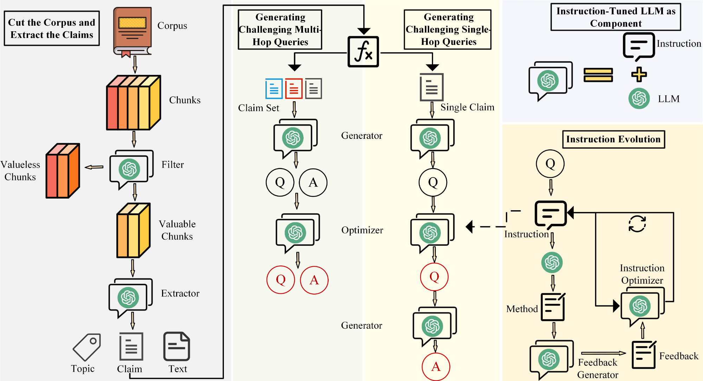

# :rocket: RAGCDs

## :star2: Overview
**RAGCDs**: A method for automatically generating query-answer pairs from PDF papers, capable of producing challenging multihop queries and difficult single queries, suitable for testing Retrieval-Augmented Generation (RAG) systems.

## :clipboard: Workflow


## :zap: Quick Start

### 1. :hammer_and_wrench: Create Virtual Environment

```bash
conda create --name RAGCDs python=3.11
conda activate RAGCDs
pip install poetry
poetry install

```

### 2. :memo: Set YAML File to Produce Queries

You can modify your configuration in `generator.yaml` located in the `config` folder

```yaml
# The path of the dataset used to generate QA pairs
input_folder: './data/dataset'

# Output data path
output_folder: './data'

# Instruction iteration times
iter_time: 3

# Type of generator to use, you can choose gpt-4o or yi-large
generator: gpt-4o
```
### 3. :dart: Start to Produce Queries and Corresponding Answers

```bash
python auto_qa_generator.py
```

After execution, by default, the QA you generate will be stored in `queries.json` in the `data` folder

## :mag: Evaluate the QA You Generated (Optional)

### 1. :memo: Set YAML File to evaluate Queries
You can modify your configuration in `evaluator.yaml` located in the `config` folder

```yaml
# QA files that need to be evaluated
QA_input_file: './data/queries.json'

# Original text used for retrieval
text_input_folder: './data/dataset'

# Output file of evaluation results
output_folder: './data'

# Deciding one or more retrievers
retrievers:
  - hybrid_retriever
  - vector_retriever
  - bm25_retriever

# The top_k of the retriever
top_k: 5

# The cutting method of nodes for retriever
chunk_size: 300
chunk_overlap: 20

# Deciding one or more models
models:
  - gpt-4o
  - yi-large
  - deepseek
```
### 2. :rocket: Start to Evaluate the QA

```bash
python auto_qa_evaluator.py
```